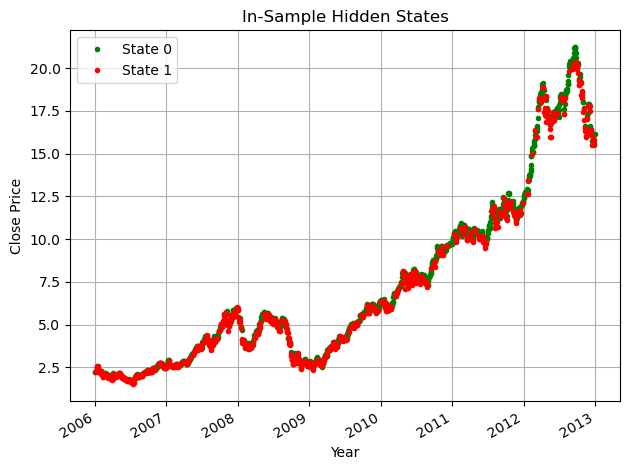
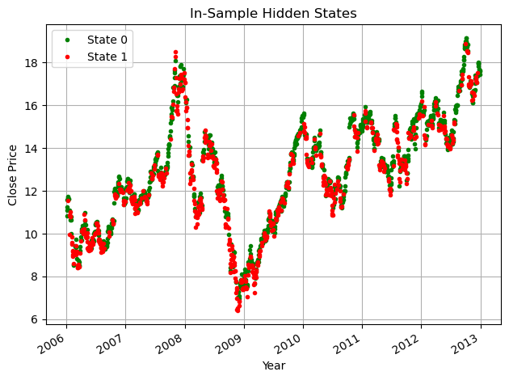
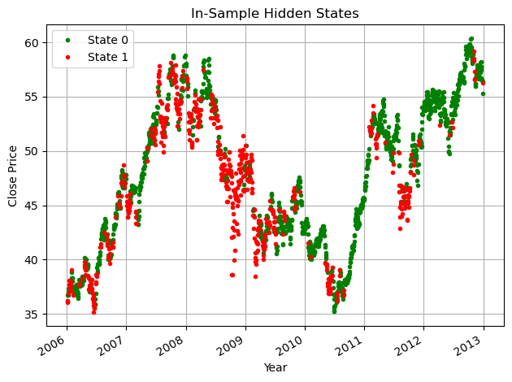
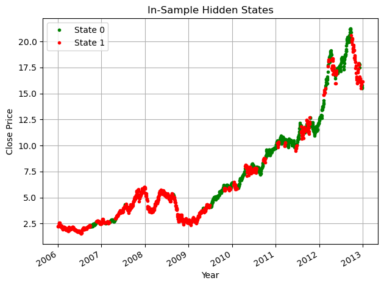
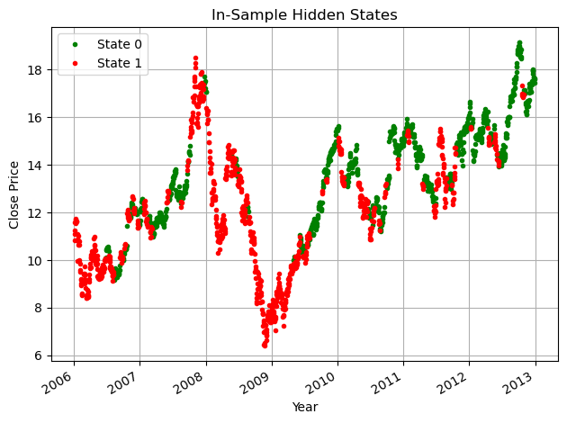
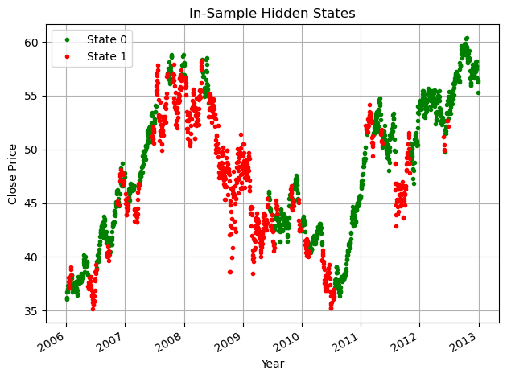
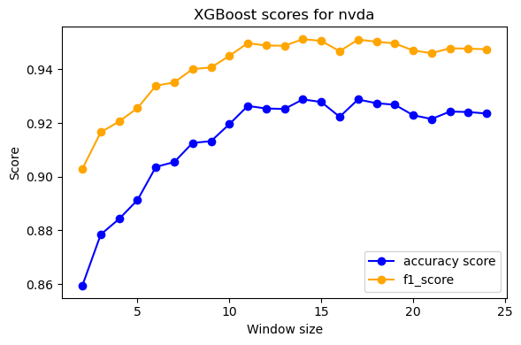
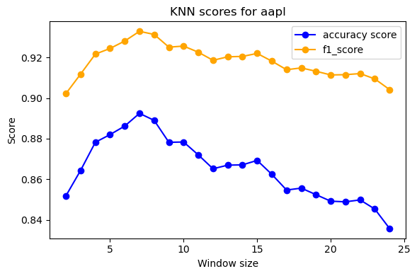
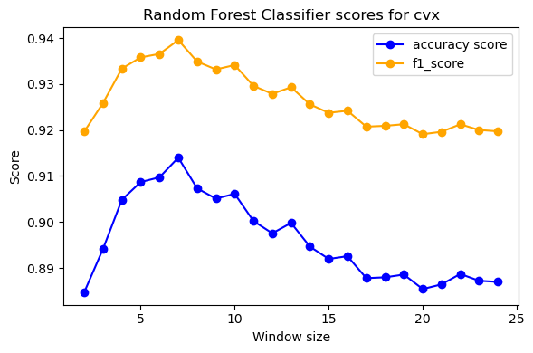

# Regime Switch Detection
## Overview
Regime detection has been a crucial field of investigation ever since the market crash in 2009. Broadly speaking, the stock market oscillates between two states: Bearish and Bullish, signified by periods of great volatility and steady growth, respectively. In this project, we aim to predict the aforementioned regimes by examining the trading data of stocks for several companies in various sectors. Additionally, we incorporate sentiment analysis into the previous analysis and investigate possible correlations.

## Requirements
The following libraries are used and needed to run all the files in this repository.
    
    - sklearn
    - sktime
    - numpy
    - pandas
    - matplotlib
    - pickle (for storing some of the large data structures)
    - optuna
    - transformers
    - beautifulsoup
    - sentence_transformers

Additionally, the code is in Jupyter Notebook format. So you need Jupyter Notebook or VS Code to run the code.

## Data Collection

1. We scrape stock data from [stooq.com](https://stooq.com) and news headlines from [businessinsider.com](businessinsider.com). The scraping code can be found in data_scraper.ipynb.  

2. For the news headlines, we use BERT and regex to remove duplicates and irrelevant headlines. This code can be found in duplication_removal.ipynb and remove_irrelevant.ipynb.  

3. We use GaussianHMM to generate labels representing market states for each of the seven stocks (stock_hmm.ipynb). To reduce noise in the data, we use Kalman filters to generate better labels (kalman.ipynb). The charts below are for AAPL, GOOGL, and XOM respectively.

Without Kalman 

  

With Kalman

  

4. We use FinBERT to assign sentiment scores to news headlines (sentiment_analysis_FinBERT.ipynb) and average them over each day (average_sentiment_scores.ipynb).

## Training

The following is a list of models we train (training_kalman.ipynb):  
   - k-Nearest Neighbor
   - DecisionTree
   - AdaBoost
   - XGBoost
   - RandomForests
   - Support Vector Machines
   - Logistic Regression
   - Constant baseline prediction
 
We use TimeSeriesSplit for cross-validation and create sliding windows to generate our training data (this code can also be found in training_kalman.ipynb; we used pickle to save this data since it takes a long time to generate). We also ran the cross-validation code over various lengths of sliding windows. Here are some charts we got from that:  

  
  

We use f1_score as our measurement of performance. Here is a table showing some of the best results from each model after tuning hyperparameters with Optuna/GridSearchCV.

Click to see the table

<table border="1" class="dataframe">
  <thead>
    <tr style="text-align: right;">
      <th></th>
      <th>Models(rows)/Stocks(columns)</th>
      <th>aapl</th>
      <th>googl</th>
      <th>nvda</th>
      <th>dal</th>
      <th>xom</th>
      <th>cvx</th>
      <th>vz</th>
    </tr>
  </thead>
  <tbody>
    <tr>
      <th>0</th>
      <td>Naive_0</td>
      <td>0.88</td>
      <td>0.86</td>
      <td>0.85</td>
      <td>0.96</td>
      <td>0.82</td>
      <td>0.83</td>
      <td>0.92</td>
    </tr>
      <th>1</th>
      <td>XGBoost</td>
      <td>0.92</td>
      <td>0.90</td>
      <td>0.95</td>
      <td>0.96</td>
      <td>0.93</td>
      <td>0.93</td>
      <td>0.95</td>
    </tr>
    <tr>
      <th>2</th>
      <td>Ada Boosting</td>
      <td>0.91</td>
      <td>0.89</td>
      <td>0.93</td>
      <td>0.96</td>
      <td>0.93</td>
      <td>0.93</td>
      <td>0.95</td>
    </tr>
    <tr>
      <th>3</th>
      <td>Decision Tree</td>
      <td>0.87</td>
      <td>0.85</td>
      <td>0.88</td>
      <td>0.89</td>
      <td>0.87</td>
      <td>0.88</td>
      <td>0.92</td>
    </tr>
    <tr>
      <th>4</th>
      <td>Random Forest Classifier</td>
      <td>0.90</td>
      <td>0.90</td>
      <td>0.93</td>
      <td>0.96</td>
      <td>0.93</td>
      <td>0.93</td>
      <td>0.95</td>
    </tr>
    <tr>
      <th>5</th>
      <td>KNN</td>
      <td>0.93</td>
      <td>0.91</td>
      <td>0.93</td>
      <td>0.97</td>
      <td>0.90</td>
      <td>0.93</td>
      <td>0.95</td>
    </tr>
    <tr>
      <th>6</th>
      <td>Tuned XGBoost</td>
      <td>0.92</td>
      <td>0.90</td>
      <td>0.95</td>
      <td>0.96</td>
      <td>0.93</td>
      <td>0.94</td>
      <td>0.96</td>
    </tr>
    <tr>
      <th>7</th>
      <td>Tuned Logistic Regression</td>
      <td>0.93</td>
      <td>0.92</td>
      <td>0.96</td>
      <td>0.97</td>
      <td>0.95</td>
      <td>0.95</td>
      <td>0.96</td>
    </tr>
    <tr>
      <th>8</th>
      <td>SVM</td>
      <td>0.94</td>
      <td>0.91</td>
      <td>0.95</td>
      <td>0.97</td>
      <td>0.94</td>
      <td>0.94</td>
      <td>0.96</td>
    </tr>
  </tbody>
</table>

## Final Testing
After we selected our models (SVC for AAPL and VZ, Logistic Regression for everything else), we predict states for the period August 3, 2023 - December 31, 2024. We get the following table as our final results:  
<table>
<tr>
<th>Stocks</th>
<th>AAPL</th>
<th>GOOGL</th>
<th>NVDA</th>
<th>DAL</th>
<th>XOM</th>
<th>CVX</th>
<th>VZ</th>
</tr>
<tr>
<th>F1 (bullish)</th>
<td>0.98</td>
<td>0.94</td>
<td>0.85</td>
<td>0.99</td>
<td>0.97</td>
<td>0.95</td>
<td>0.95</td></tr>
<tr><th>F1 (bearish)</th>
<td>0.70</td>
<td>0.62</td>
<td>0.73</td>
<td>0.88</td>
<td>0.64</td>
<td>0.59</td>
<td>0.73</td></tr>
<tr><th>
Accuracy</th>
<td>96%
</td><td>90%
</td><td>80%
</td><td>99%
</td><td>95%
</td><td>92%
</td><td>92%
</td></tr>
  
</table>  
The high accuracy for DAL can be explained by the highly imbalanced labels for the stock. The relatively low accuracy for NVDA can be attributed to the recent volatility in the stock caused by the LLM boom, which was not represented in the training data.

### Sentiment Analysis
We incorporated the sentiment scores generated from the news headlines as an additional feature for training (training_with_sentiment.ipynb). However, this resulted in minimal to no improvement. This could be due to our chosen stocks being less sensitive to sentiment-driven movements. In the future, we aim to explore more robust sentiment analysis techniques to achieve more meaningful results in this direction.

## Final Thoughts  

Additonally we ran the GOOGL trained model on MSFT stock data (not seen by any of our models before) and yielded positive results (accuracy score of 95.5% and F1-Score of 97.5%). This could indicate strong correlation between companies within the same market sector. For future directions, we could:

 - Create models that cover multiple stocks from the same sector at once and investigate the correlation between companies with similar business models.
  - Implement better/more advanced sentiment analysis based on social media sentiment in addition to news headlines.
  - Consider more than two states representing the market and interpret them accordingly.
  - Introduce backtesting frameworks to evaluate the practical trading performance of our models in real-world scenarios.

## References  
Here are some existing research/articles that guided us in this project.

 - An, Sufang, et al. “Early warning of regime switching in a complex financial system from a spillover network dynamic perspective.” iScience, vol. 28, no. 3, 2025.
 - Wang, Matthew, et al. “Regime-Switching Factor Investing with Hidden Markov Models.” J. Risk Financial Management, vol. 13, no. 12, 2020.
 - Franke, Jürgen. “Markov Switching Time Series Models.” Handbook of Statistics, vol. 30, 2012, pp. 99-122.
 - [Luck, Spencer. “Time Series Regime Analysis in Python.” medium.com, 13 Oct 2022](https://medium.com/@spencer13luck/time-series-regime-analysis-in-python-ffdc7aa005dd.).
 - [Holls-Moore, Michael. “Hidden Markov Models for Regime Detection using R”](https://www.quantstart.com/articles/hidden-markov-models-for-regime-detection-using-r/).
